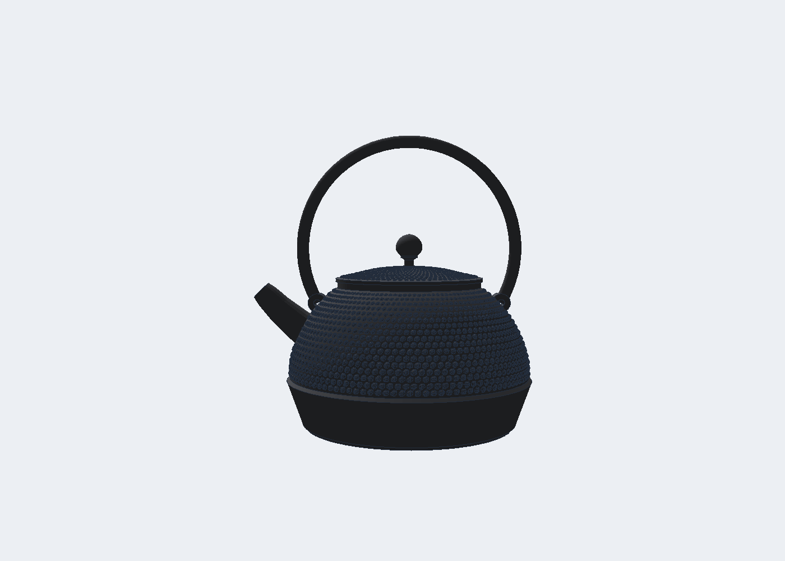
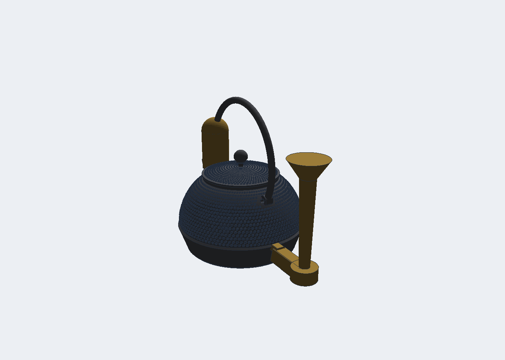
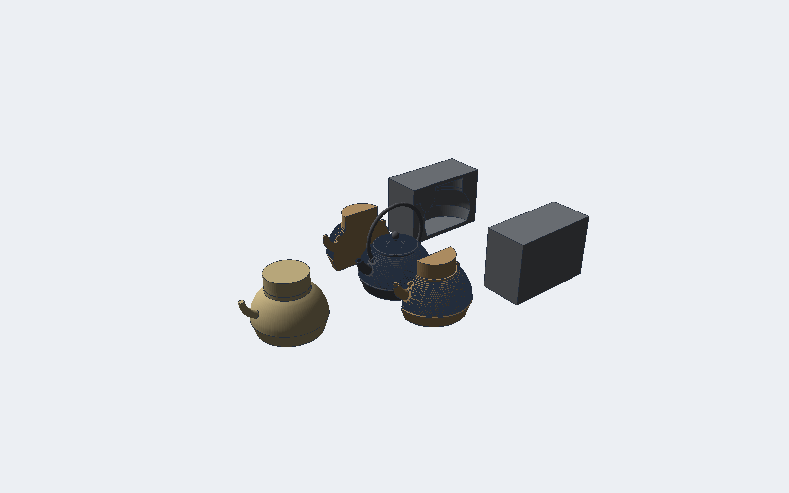

# Cast iron kettle (tetsubin)

A sample project that drives Anvil toward casting work. The target is a
kettle in the style of the Iwachu "9 type flat round" (hiramaru) tetsubin:
a flat bottom, a plain lower band, a sharp ridge at about one third of the
height, a domed upper body covered in raised dots, a short curved spout,
two lugs for a bail handle, and a domed lid with a lotus bud knob.

Reference (Iwachu product 11702, tortoiseshell pattern): 18 x 16 x 18.5 cm
with the handle, 1.1 L full, about 1.5 kg. The 7-type and 9-type arare
kettles have single-size dots that shrink toward the mouth.

## Plan

Each stage is usable on its own. Stages 1 to 3 are the shape. Stage 4 is
the mold. Stage 5 is the simulation.

| Stage | Result | Anvil work |
| --- | --- | --- |
| 1 | Body of revolution with dots | Hobnail feature (revolve with relief), localized booleans |
| 2 | Spout, lugs, bail, lid, knob | Tapered pipe, sample document `kettle()` |
| 3 | Sprue, runner, gates, riser | Casting ribbon tab, first layout on the kettle |
| 4 | Pattern halves, core, core prints | Parting plane split, draft check, shrink scale (first cut done) |
| 5 | Fill and solidification | Casting check (textbook numbers) and a Truchas case export (first cut done); a voxel model later |

Spout: the shape must pour without dripping. The rules of thumb are a
sharp thin lip, a bore that narrows toward the tip, an outlet above the
full water level, and a rise of 40 to 50 degrees. The spout is parametric
so these can be tuned, and stage 5 can test pouring later.

## Design decisions

Dots are a displacement of a fine revolve mesh, not a boolean of many
spheres. One kettle has about 1500 dots. A boolean per dot would take
minutes and leave fragments. The Hobnail feature revolves the profile at
a chosen resolution (segments around, step along the profile) and moves
each vertex along the surface normal by the bump height. The result is a
single watertight triangle mesh, so slicers, the mold split, and a voxel
simulation all accept it.

Dot rows keep a constant count, so the dots line up in spiral columns and
shrink as the radius shrinks, the way a real arare kettle looks. The
tortoiseshell layout is one large dot ringed by small dots in each cell.

Booleans on the dotted body (spout, lugs, bore) must stay fast. The BSP
boolean now keeps polygons that lie outside the other body's bounding box
without clipping them, and builds the BSP trees only from the polygons
near the overlap. Leaves of a partial tree are classified with a ray test
against the full mesh, so the result is still exact.

## Dimensions (mm)

| Item | Value | Note |
| --- | --- | --- |
| Body diameter at the ridge | 160 | |
| Ridge height | 30 | flat band below |
| Body height to the rim | 95 | without lid |
| Mouth diameter | 88 | lid seat |
| Wall thickness | 3.0 | cast iron |
| Dot pitch | 4.5 | at the ridge |
| Dot height | 1.0 | |
| Spout base, tip diameter | 24, 15 | outside |
| Bail bar diameter | 8 | |
| Lid diameter | 96 | sits on the mouth |

## The sample (stage 1 and 2 done)

Examples > Casting samples > Kettle, or `anvil_io::kettle::kettle()`. The document
builds in about 4 seconds on a workstation and renders in under a
second. Three bodies: body 208 cm3 (1.50 kg in cast iron), bail 15 cm3,
lid 27 cm3. The spout tip reaches x = 101 mm, so the kettle is 181 mm
wide, the bail apex is at 189 mm.

Build order in the history:

| Step | Feature | Note |
| --- | --- | --- |
| 0, 1 | Sketch, Revolve 96 segments | Closed profile with the wall: outer dome and inner dome are splines |
| 2 to 4 | Sketch, Pipe 24 to 15 mm, Combine join | Spout along an arc, tapered |
| 5 to 7 | Sketch, Revolve 40 degrees, Combine cut | A wedge of the cavity removes the spout stub inside |
| 8 to 10 | Sketch, Pipe 18 to 11 mm, Combine cut | Bore through the wall and out of the tip |
| 11, 12 | Sketch, Extrude join | Two lug bosses on the shoulder |
| 13, 14 | Hole | Pin holes through the lugs |
| 15 | Pattern on face | Hobnail dots on the outer dome, last |
| 16, 17 | Sketch, Pipe 8 mm | Bail arch |
| 18, 19 | Sketch, Revolve | Lid shell with a locating ring |
| 20 to 22 | Sketch, Revolve, Combine join | Bud knob |
| 23 | Pattern on face | Dots on the lid top |

The pattern goes last on each body so every boolean runs on the coarse
mesh. Only the facets the spout and the lugs pass through stay smooth,
so the dots run up to their edges. Facets next to a seam carry the
split vertices the boolean sewed in; the pattern refines them and keeps
those vertices, so the mesh stays closed.

Expressions: dot_pitch, dot_size, dot_height, spout_d, spout_tip,
bore_d, bore_tip, bail_d, lug_hole, segments. Change one in the
Expressions panel and the kettle rebuilds.

## Gating (stage 3, first layout)

Examples > Casting samples > Kettle + gating, or `anvil_io::kettle::kettle_gated()`.
The parting plane is at the ridge (z = 30), the widest section: the drag
holds the base and the cope holds the dome and the spout. A sprue on
the side away from the spout has its pouring cup at z = 150 and its well
below the parting plane. A runner in the drag carries the metal to an
ingate in the ridge band. A blind riser sits over the spout base, the
thickest junction. All four are features on the Casting panel of the Solid tab with expressions
`part_z` and `pour_z`, so the layout moves with the plane.

This layout is a starting point. The mold split (stage 4) adds the core
for the inside and the core prints, and the flow model (stage 5) decides
gate sizes and riser positions.

## Mold (stage 4, first cut)

Examples > Casting samples > Kettle mold, or `anvil_io::kettle::kettle_mold()`. The
parting plane is vertical, the XZ plane through the spout and the lugs,
so the two pattern halves pull along Y. A body of revolution split
through its axis has no undercut along that pull, the spout lies in the
plane, and the lug bosses and pin holes point along the pull.

The sample builds five printable parts, laid out side by side and scaled
by 1.01 for the shrink of grey cast iron:

| Part | How it is made |
| --- | --- |
| Pattern halves (2) | The outer profile revolved as a solid, plus the spout, the lug bosses, the mouth core print, and the spout bore, with the dots on the dome, split on XZ |
| Core | The exact cavity revolved, plus a 43.5 mm print through the mouth and the spout bore that reaches past the tip |
| Core box halves (2) | A block minus the core, split on XZ |

Draft check (Solid tab, Casting panel) reports the undercut area of each pattern half
along its pull. The dots themselves are the only undercuts: the far side
of every dot leans away from the pull by about one millimetre. Real
arare kettles get their dots by hand-pressing the sand, so this is where
a printed pattern and a foundry pattern differ.

The gating from stage 3 is not on the pattern yet. It goes onto the
match plate between the halves, which is the next step, together with
a plane pick for the parting plane so any body can be split the same way.

## Simulation (stage 5, first cut)

Casting check on the gated kettle (Examples > Casting samples > Kettle + gating)
reports, for grey cast iron poured at 1400 C: 209 cm3 and 1.49 kg,
surface 1262 cm2, modulus 1.65 mm, and a Chvorinov freeze time of about
4 s with the starting mold constant of 1.5 s/mm2. The 135 mm sprue head
gives 1.63 m/s at a 12 mm choke, which fills the casting in 1.5 s, so the
metal is in before the thin wall freezes, with little margin. The
pressurized 1:2:1 ratio wants a 226 mm2 runner and 113 mm2 of ingates.
The riser modulus, 7.1 mm, is far above 1.2 times the casting modulus.

`anvil-cli kettle --variant gated` writes the Truchas case for the real
fill and freeze run. The numbers are starting values from the survey in
docs/research/casting_simulation.md and need one calibration pour.

## Known limits

* Booleans leave a few sliver faces at each seam: the body has about 200
  edges shared by more than two faces, the lid about 100. There are no
  open edges, so slicers accept the meshes. ADR 0001 (a tolerant kernel)
  is the real fix.
* The spout is a plain tapered tube. The lip is not thinned yet.
* An edit reruns the edited feature and everything after it. Put the
  pattern late in the history so most edits skip it. The pattern step
  itself takes under one second.

## Progress log

* 2026-09-16: plan written. Reference photos reviewed.
* 2026-09-17 (later): mold split (stage 4), casting check and the
  Truchas case export (stage 5), and the split cap and orientation fixes.
* 2026-09-17: revolve gives each smooth run its own surface; Pattern on
  face (relief) feature; booleans keep far faces and rebuild only the
  seam; tapered pipe; Casting tab (sprue, runner, riser); kettle sample
  with renders; first gating layout; the pattern now refines facets that
  carry split vertices, so the bare zone around the spout is gone. Next:
  the mold split.
