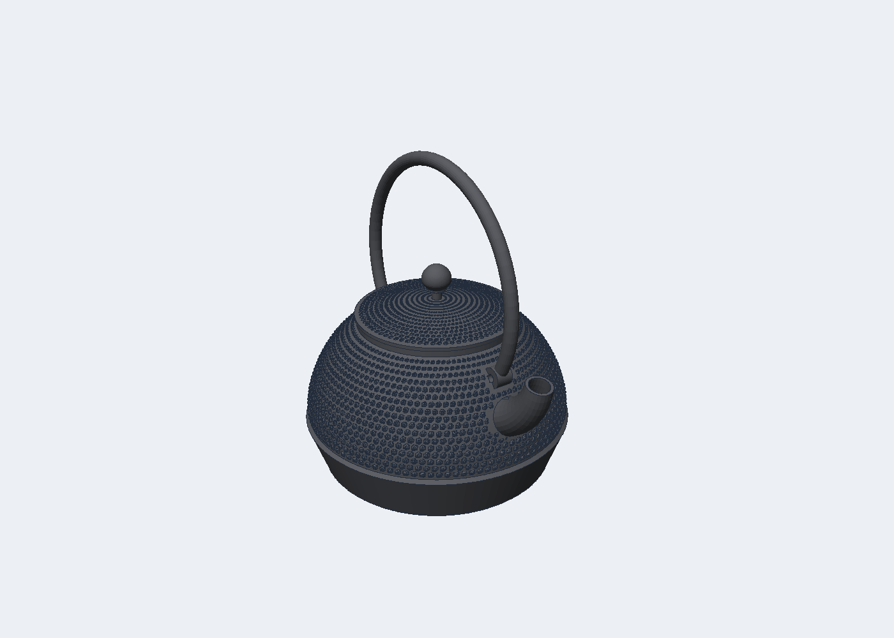

# Using Anvil

This page walks through the sketch and feature workflow as it works today.

## Start a sketch

1. On the Solid tab, click **Sketch**.
2. Three datum squares appear at the origin. Hover one and click it, or
   click a face of an existing body. The camera turns to look straight at
   that plane and the Sketch tab opens.

## Draw

The Line tool is active first. Click points. Click an existing point to
close the loop. Right-click or Esc ends the chain.

Other tools: Rect 2-pt, Rect centre, Circle centre, Circle 2-pt, Circle
3-pt, Arc 3-pt, Arc centre, Polygon (set sides in the ribbon), Slot (set
width in the ribbon), Point. Each tool's hint shows in the ribbon message.

Clicks that land on an existing point reuse that point. Turn on **Snap grid**
to snap to the grid.

## Constrain and dimension

1. Choose **Select**. Click an entity. Shift+click adds to the selection.
2. Click a constraint button. Each needs a specific selection:
   Coincident (2 points), Horizontal or Vertical (lines), Parallel,
   Perpendicular, Equal (2 lines or 2 circles), Tangent (line + circle),
   Midpoint (point + line), Concentric (2 circles), Symmetric (2 points +
   line), On curve (point + line or circle), Fix (points).
3. For a dimension, type the value in the field, then click Length /
   Distance (a line, or two points), Radius (a circle or arc), or Angle
   (two lines).

The top-left corner shows the degrees of freedom. "Fully constrained" means
zero. Drag a point with the Select tool to see the solver hold constraints.

**Delete** removes selected entities and their constraints. **Construction**
toggles selected lines to construction lines, which do not form profiles.

## Finish and build

Click **Finish Sketch**. The camera returns. Select the sketch in the Part
Navigator, then click Extrude, Revolve, Sweep, or Loft. The new feature
points at the selected sketch. Edit its parameters in the Properties panel.

Double-click a sketch in the Part Navigator to edit it again. Everything
downstream regenerates.

## Selecting and dimensioning

* Click a body to select its feature. Ctrl+click adds or removes features.
  Shift+drag draws a box; bodies fully inside are selected.
* The face under the click is highlighted. With a face selected, **Sketch**
  starts a sketch on it, and **Press Pull** (or Q) extrudes it into a new
  body. Right-click a face for the same commands.
* In a sketch, the **Dimension tool** works by clicking: a line gives a
  length, two points a distance, a circle a radius, two lines an angle. The
  measured value appears in the value field. Type a new value and press
  Enter. Click any dimension label later to edit it.
* Snaps show a marker: square for a point, triangle for a midpoint, circle
  for a centre, diamond for a circle quadrant, cross for a point on a curve.
* Drag on empty space with the Select tool to box select. Left to right
  selects entities fully inside; right to left selects anything touched.
* Right-click in a sketch for the common tools and Finish Sketch.

## Fillet, chamfer, and edges

1. Click an edge in the viewport. It turns orange. Ctrl+click adds more
   edges. The Select filter in the status bar can limit clicks to edges.
2. Press F, or Solid > Fillet or Chamfer. The feature uses the selected
   edges and their body. Set the radius or distance in Properties.
3. To change the edges later, select the Fillet feature, click new edges,
   and press **Use selected edges** in Properties.

Fillet and Chamfer work on straight edges between flat faces, on outside
and inside corners. Edges on curved facets are refused with a message.

## Placing features on a face

Click a face, then Hole, Text, QR Code, or Texture. The feature is placed
on that face with its origin at the face centre, and Hole and Text target
that body. A Hole or cut that removes nothing shows an error instead of
silently succeeding.

## Inspecting

* **Section** (status bar): cuts the view along X, Y, or Z at an offset.
  Inside faces show in red.
* **Interference** (Solid > Inspect): select one feature, Ctrl+click a
  second, and press Interference for the overlap volume.
* View buttons in the viewport corner: Top, Front, Right, Iso, Fit.
* The bottom-left corner names the face or edge under the cursor.

## History

* The ^ and v buttons in the Part Navigator move a feature earlier or
  later. A move that would put a feature before its inputs is refused.
* Deleting a feature renumbers later references. Features that used the
  deleted one show a red mark and an error that says what to choose.

## Sketch additions

* Dimension values accept expressions: type `card_w / 2` instead of a
  number. The label shows the expression and its value, and it follows
  changes in the Expressions panel.
* **Chamfer** (sketch Modify): click two lines that share a corner.
* **Tangent Arc** (Arc menu): click the end of a line or arc, then the
  arc end.
* **Import DXF**: type a path and press the button. Lines, arcs, circles,
  and polylines are added in millimetres.

## Fonts for Text

Select a Text feature and open the **Font** dropdown in Properties. It
lists the bundled fonts first, then every font installed on the computer.
Type in the search box to filter. The last row takes a path to any .ttf or
.otf file.

Bundled fonts open the same on every computer:

| Font | Stroke width at 7 mm size | Good for 0.4 mm nozzle |
| --- | --- | --- |
| Archivo Black | about 0.99 mm | Yes, recommended |
| Liberation Sans Bold | about 0.70 mm | Borderline; use Thicken 0.05 or a larger size |
| DejaVu Sans Bold | a little thicker than regular | Borderline |
| DejaVu Sans | about 0.54 mm | No at 7 mm |
| DejaVu Serif, Serif Bold, Sans Mono | thin | No at small sizes |

Properties shows the stroke width under the Text feature and says when it
is too thin for a 0.4 mm nozzle. **Thicken strokes** grows every letter
outward by the given distance, which works with any font. A rule of thumb:
strokes should be at least twice the nozzle width.

A document that uses an installed font stores the file path. On another
computer without that font the Text feature shows an error; pick a bundled
font to share files.

## Business card with a LinkedIn QR code

A 3D-printable business card with your name and a QR code that opens your
LinkedIn profile or website. The name and the code are separate parts, so
a multi-colour printer can print them in a second colour.


| Item | Value |
| --- | --- |
| Size | 85.6 by 53.98 mm, the size of a credit card |
| Corners | two opposite corners 0.5 in (12.7 mm), the other two 0.25 in (6.35 mm) |
| Thickness | 0.8 mm card, 0.6 mm raised name and code |
| Name font | Archivo Black, strokes about 1 mm wide at 7 mm size |
| QR code | 24 mm square; modules about 0.8 mm for a typical LinkedIn link |

### Make your card

```
cargo run --release -p anvil-ui --example export_qr_card -- out "Your Name" "https://www.linkedin.com/in/your-handle"
```

This writes three files to `out`:

* `business_card.stl`: the whole card as one file, for a single colour.
* `business_card.3mf`: the card, the name, and the code as separate parts.
* `business_card.anvil`: the editable Anvil document.

It also writes `business_card.ppm`, a top-view preview.

Without installing Rust, use the Docker image (see the README):

```
docker build -t anvil-cad .
docker run --rm -v "$PWD/out:/out" anvil-cad card --name "Your Name" --url "https://www.linkedin.com/in/your-handle" --font "Archivo Black"
```

The container writes the STL, 3MF, and Anvil files but no preview image.

### Or edit it in the app

1. File > Samples > **Business card**.
2. Select the Text feature and type your name in Properties. Pick a font
   from the Font dropdown; Properties shows whether the strokes are thick
   enough for a 0.4 mm nozzle.
3. Select the QR Code feature and paste your profile link.
4. The Expressions panel holds `card_t` (card thickness) and `emboss`
   (relief height) if you want to change them.
5. File > **3MF (parts)** or **STL**.

### Printing tips

* In Bambu Studio, open the 3MF and keep it as one object with multiple
  parts. Select the name and the QR code parts and give them the second
  filament.
* Scan the code on the printed card before you hand any out. A shorter
  link gives larger QR modules, which print and scan more reliably.
  LinkedIn's custom profile URL is shorter than the default one.
* Keep the light card and dark code (or the reverse). Low contrast between
  the two filaments makes the code hard to scan.

## Bodies

Click a body in the viewport to select its feature. Move/Copy, Scale,
Mirror, and the patterns take a body feature as input; they default to the
selected feature. Measure shows the volume and bounding box in the status
bar.

## Casting tab

The Casting tab holds three features for laying out a sand casting gating
system. Each one makes a single body, in the Gating group.

**Sprue.** The channel that carries poured metal down into the mold. Set
the x and y position of its vertical axis and the z of its top rim. It is
built as one solid of revolution: a pouring cup at the top, a tapered
shaft below it, and a well at the bottom that slows the metal before it
reaches the runner. Defaults: pouring cup diameter 40 mm and depth 20 mm,
sprue top diameter 18 mm, sprue bottom diameter 12 mm, sprue height
120 mm, well diameter 30 mm and depth 15 mm.

**Runner.** The horizontal channel that carries metal from the sprue well
to the part. Set a start point and an end point; both ends share the same
bottom z, since a runner runs flat in the parting plane. The cross
section is a trapezoid, wider at the bottom than the top, so the sand
pattern lifts out cleanly. Defaults: width 20 mm, height 15 mm, taper 0.
Taper is a fraction from 0 to 1 that shrinks the width from the start end
to the end end, for a runner that narrows along its length.

**Riser.** A reservoir that feeds extra metal into the casting as it
cools, so shrinkage does not leave a void in the part. It is a cylinder
on a narrower neck, set by x, y, and the z of the base of the neck.
Defaults: diameter 50 mm, height 80 mm, neck diameter 25 mm, neck length
10 mm. When blind is on (the default), the top is domed, so the riser
closes over and holds its heat longer. When blind is off, the top is
flat and open.

## Pattern on face (hobnail dots)

Raised dots over one continuous curved surface, as on a cast iron
kettle. The dots become part of the body as one watertight mesh.

1. Make a body of revolution with Revolve. Set Segments per turn to 96
   or more for a smooth body (the default is 64).
2. Click the surface you want. Every facet of that surface counts as one
   face: a click on the dome selects the whole dome.
3. Solid > Pattern on face. The feature takes the surface from the pick.
4. Set Layout, Pitch, Dot diameter, Dot height, Margin, and Mesh step.

Layouts: `hobnail` (arare) is one dot size in staggered rows. Each row
has the same number of dots, so the dots line up in spiral columns and
shrink toward the narrow end. `tortoiseshell` (kikko) is one large dot
ringed by ten small ones in each cell. Dots per row (0 = from pitch)
fixes the count. Dot diameter at far end (0 = scale with the radius)
gives a linear taper instead.

Only the picked surface changes. The inner wall, the rim, and every
other face stay as they were. Put the pattern after the cuts and joins
that touch that surface: the facets a cut passes through stay smooth, so
the dots stop at the edge of a spout or a lug. A dot is either whole or
absent: any dot that would reach a cut edge or the end of the surface
is dropped, and the feature note says how many. The pattern refines the surface
to the mesh step, so a kettle body has about 200 thousand faces. A
boolean on that body still takes about one second, because the boolean
only rebuilds the faces near the tool.



The `machinery` layout replaces the dots with a procedural mesh of half
round tubes (ring arcs, runs along the axis with bends), bosses, and
bolt heads, for the look of dense plumbing on a small model. Pitch is
the spacing of the rings and runs, Dot diameter the tube diameter,
Dot height the tube height, and Seed picks one of many meshes. Tubes
that would reach a cut edge or the end of the surface are dropped whole,
like dots. On a vertical wall printed upright the tubes are small
overhangs that need no support.

## Tapered pipe

Pipe has a second value, Diameter at end. Leave it at 0 for one
diameter along the whole path. Set it for a spout that narrows toward
the tip: the section scales linearly by arc length.

## Kettle sample

File > Samples > Kettle loads a cast iron kettle: body, bail, and lid as
three bodies. It uses the pattern, the tapered pipe, the wedge cut, the
lug bosses, and the holes. Kettle + gating adds a sprue, a runner, an
ingate, and a riser from the Casting tab. Read docs/KETTLE.md for the
dimensions, the build order, and the casting plan.

## Export

File > Export opens a dialog. Pick a format, then a native save dialog
asks where to write. If the file exists, a second window asks before it
is replaced. File > Save As does the same for the .anvil document.

| Format | What you get |
| --- | --- |
| STL (one file) | Every body in one binary STL |
| STL (one file per feature) | One STL per feature next to the chosen name |
| 3MF (one object per feature) | Slicers load each feature as its own object |
| 3MF (one object) | One object with one part per feature; the slicer merges overlaps and prints one piece |
| OBJ | One group per feature, names kept |
| PLY (binary) | One mesh, for MeshLab and point cloud tools |
| OFF | One mesh, for CGAL and research tools |
| AMF | One object with one volume per feature |
| glTF 2.0 | One file with the buffer embedded, metres and Y up, for web viewers |
| STEP AP214 | Faceted B-rep: every planar face as a face with polygon loops, one solid per body |
| Anvil document | The history, same as Save |

The STEP file is exact for this kernel because its faces are planar. A
STEP reader shows the facets as faces; it will not turn them back into
cylinders. The writer follows the standard but has not yet been checked
against a reader here.

## Healing after a boolean

A join whose tool grazes a face used to leave a sliver hole. The
boolean now closes any open loop smaller than one percent of the body
after the seam repair, so a long chain of joins stays watertight. A bigger hole still shows in the open edge count, because
it means a real defect.

## Lattice fill

Lattice fill (Solid tab, Field group) replaces the inside of a body with
a lattice under a solid skin, the way nTop lightens a part. Pick the
body, choose the lattice, and set the cell size, the thickness (sheet
wall or beam diameter), the skin thickness, and the resolution.

Lattices: three sheet lattices on a minimal surface (gyroid, schwarz,
diamond) and four beam lattices on a unit cell (cubic, bcc, octet,
kelvin). Grade along x, y, z, or radially to ramp the thickness from
Thickness to Thickness at far end across the body. Conform to cylinder
wraps the cells around the Z axis so they follow a round wall.

The body is sampled into a signed distance grid at the resolution, the
skin and the lattice are combined as fields, and the zero surface is
meshed back into a body with surface nets. No B-rep boolean runs, so it
works on any closed body, including a patterned one, and the time
depends only on the grid size. The note gives the triangle count, the
volume as a percentage of the solid body, and the voxel count. Keep the
thickness at least two voxels; the feature refuses thinner walls. A
lattice body is a mesh: later features can move, pattern, split, and
export it, but a boolean on it is slow.

Headless: `anvil-cli lattice --stl part.stl --kind octet --cell 8
--wall 1.2 --grade z --wall-end 2.4 --out DIR` fills any closed STL and
writes STL, 3MF, and STEP. docs/research/implicit_modeling.md is the
plan for the field driven product that grows from this feature.

## Aircraft

Aircraft (Solid tab, Field group) builds a fuselage, a lofted NACA wing,
a tailplane, and a fin as one implicit body, and reports a lifting line
estimate for it. Parameters: fuselage length and diameter, wing
position, span, root and tip chord, leading edge sweep, dihedral, root
incidence and tip twist, root and tip airfoils as NACA four digit
codes, tail and fin sizes, the wing to body blend radius, the trailing
edge thickness (keep it near the nozzle width for a print), the
resolution, and the design lift coefficient and speed for the estimate.

The note gives wing area, aspect ratio, taper, the angle of attack that
reaches the design lift coefficient, induced and profile drag, span
efficiency, and lift to drag. Tick Optimise to let a Nelder Mead search
adjust taper and tip twist for the best lift to drag at the same span
and area; the geometry and the note follow. The estimate is Prandtl's
lifting line with a flat plate profile drag: right for trends in early
design, to be checked with XFOIL or a CFD run before anything flies.
docs/research/wing_aero_loop.md has the equations and the external tools
this can connect to.

## Casting check and the Truchas export

Casting check (Casting tab, Check group) takes the casting body, an
alloy (grey cast iron, A356 aluminium, or AZ91 magnesium), the pouring
temperature, and optionally a sprue and a riser. Its note gives the
volume, the mass, the surface area, the casting modulus, the Chvorinov
solidification time, whether the pour is inside the alloy's range, the
speed and fill time through the sprue choke, the runner and ingate
areas from the alloy's gating ratio, and the riser modulus rule. The
mold constant is a starting value: calibrate it from one real pour.

`anvil-cli kettle --variant gated --out DIR` also writes a Truchas case
into `DIR/truchas`: `cavity.stl` (casting plus gating as one mesh), a
`casting.inp` deck with the alloy numbers, and a README with the
meshing steps. The deck is a template; check it against the Truchas
reference manual before a run.

## Mold split

Split body (Solid tab) cuts a body on a datum plane and keeps one or
both halves; the halves are closed with a flat cap. Draft check
(Casting tab, Mold group) reports how much of a body faces away from a
pull direction, so you can tell whether a pattern half will leave the
sand. Scale by 1.01 for grey cast iron shrink. File > Samples > Kettle
mold shows the whole flow: pattern halves, core, and core box.

## What is not there yet

Shell reports "not supported by this kernel yet". Booleans are a BSP
method on planar facets (ADR 0001): they leave a few sliver faces at a
seam, so an edge there can be shared by more than two faces. Slicers
accept the result. A tolerant kernel is planned for milestone M3.
