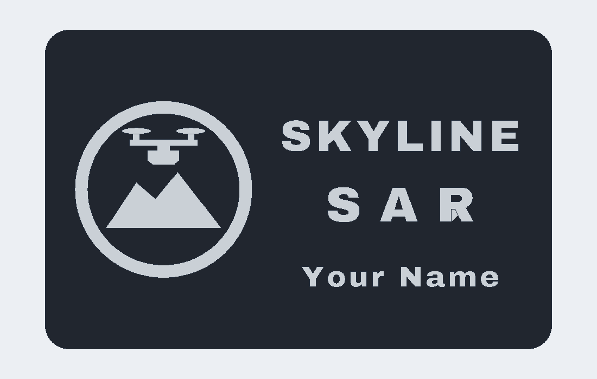

# Using Anvil

This page walks through the sketch and feature workflow as it works today.

## Start a sketch

1. On the Solid tab, click **Sketch**.
2. Three datum squares appear at the origin. Hover one and click it, or
   click a face of an existing body. The camera turns to look straight at
   that plane and the Sketch tab opens.

## Draw

The Line tool is active first. Click points. Click an existing point to
close the loop. Right-click or Esc ends the chain.

Other tools: Rect 2-pt, Rect centre, Circle centre, Circle 2-pt, Circle
3-pt, Arc 3-pt, Arc centre, Polygon (set sides in the ribbon), Slot (set
width in the ribbon), Point. Each tool's hint shows in the ribbon message.

Clicks that land on an existing point reuse that point. Turn on **Snap grid**
to snap to the grid.

## Constrain and dimension

1. Choose **Select**. Click an entity. Shift+click adds to the selection.
2. Click a constraint button. Each needs a specific selection:
   Coincident (2 points), Horizontal or Vertical (lines), Parallel,
   Perpendicular, Equal (2 lines or 2 circles), Tangent (line + circle),
   Midpoint (point + line), Concentric (2 circles), Symmetric (2 points +
   line), On curve (point + line or circle), Fix (points).
3. For a dimension, type the value in the field, then click Length /
   Distance (a line, or two points), Radius (a circle or arc), or Angle
   (two lines).

The top-left corner shows the degrees of freedom. "Fully constrained" means
zero. Drag a point with the Select tool to see the solver hold constraints.

**Delete** removes selected entities and their constraints. **Construction**
toggles selected lines to construction lines, which do not form profiles.

## Finish and build

Click **Finish Sketch**. The camera returns. Select the sketch in the Part
Navigator, then click Extrude, Revolve, Sweep, or Loft. The new feature
points at the selected sketch. Edit its parameters in the Properties panel.

Double-click a sketch in the Part Navigator to edit it again. Everything
downstream regenerates.

## Selecting and dimensioning

* Click a body to select its feature. Ctrl+click adds or removes features.
  Shift+drag draws a box; bodies fully inside are selected.
* The face under the click is highlighted. With a face selected, **Sketch**
  starts a sketch on it, and **Press Pull** (or Q) extrudes it into a new
  body. Right-click a face for the same commands.
* In a sketch, the **Dimension tool** works by clicking: a line gives a
  length, two points a distance, a circle a radius, two lines an angle. The
  measured value appears in the value field. Type a new value and press
  Enter. Click any dimension label later to edit it.
* Snaps show a marker: square for a point, triangle for a midpoint, circle
  for a centre, diamond for a circle quadrant, cross for a point on a curve.
* Drag on empty space with the Select tool to box select. Left to right
  selects entities fully inside; right to left selects anything touched.
* Right-click in a sketch for the common tools and Finish Sketch.

## Fillet, chamfer, and edges

1. Click an edge in the viewport. It turns orange. Ctrl+click adds more
   edges. The Select filter in the status bar can limit clicks to edges.
2. Press F, or Solid > Fillet or Chamfer. The feature uses the selected
   edges and their body. Set the radius or distance in Properties.
3. To change the edges later, select the Fillet feature, click new edges,
   and press **Use selected edges** in Properties.

Fillet and Chamfer work on straight edges between flat faces, on outside
and inside corners. Edges on curved facets are refused with a message.

## Placing features on a face

Click a face, then Hole, Text, QR Code, or Texture. The feature is placed
on that face with its origin at the face centre, and Hole and Text target
that body. A Hole or cut that removes nothing shows an error instead of
silently succeeding.

## Inspecting

* **Section** (status bar): cuts the view along X, Y, or Z at an offset.
  Inside faces show in red.
* **Interference** (Solid > Inspect): select one feature, Ctrl+click a
  second, and press Interference for the overlap volume.
* View buttons in the viewport corner: Top, Front, Right, Iso, Fit.
* The bottom-left corner names the face or edge under the cursor.

## History

* The ^ and v buttons in the Part Navigator move a feature earlier or
  later. A move that would put a feature before its inputs is refused.
* Deleting a feature renumbers later references. Features that used the
  deleted one show a red mark and an error that says what to choose.

## Sketch additions

* Dimension values accept expressions: type `card_w / 2` instead of a
  number. The label shows the expression and its value, and it follows
  changes in the Expressions panel.
* **Chamfer** (sketch Modify): click two lines that share a corner.
* **Tangent Arc** (Arc menu): click the end of a line or arc, then the
  arc end.
* **Import DXF**: type a path and press the button. Lines, arcs, circles,
  and polylines are added in millimetres.

## Fonts for Text

Select a Text feature and open the **Font** dropdown in Properties. It
lists the bundled fonts first, then every font installed on the computer.
Type in the search box to filter. The last row takes a path to any .ttf or
.otf file.

Bundled fonts open the same on every computer:

| Font | Stroke width at 7 mm size | Good for 0.4 mm nozzle |
| --- | --- | --- |
| Archivo Black | about 0.99 mm | Yes, recommended |
| Liberation Sans Bold | about 0.70 mm | Borderline; use Thicken 0.05 or a larger size |
| DejaVu Sans Bold | a little thicker than regular | Borderline |
| DejaVu Sans | about 0.54 mm | No at 7 mm |
| DejaVu Serif, Serif Bold, Sans Mono | thin | No at small sizes |

Properties shows the stroke width under the Text feature and says when it
is too thin for a 0.4 mm nozzle. **Thicken strokes** grows every letter
outward by the given distance, which works with any font. A rule of thumb:
strokes should be at least twice the nozzle width.

A document that uses an installed font stores the file path. On another
computer without that font the Text feature shows an error; pick a bundled
font to share files.

## Logo business card sample

File > Samples > **Logo card** builds a name-and-logo card for Skyline SAR,
a drone search and rescue startup:

* Card: 85.6 by 53.98 mm, 0.8 mm thick, 4 mm corners.
* Logo: one sketch holding a scan ring, two mountain peaks, a quadcopter,
  and two propellers. One sketch means one part in the 3MF file, so the
  whole mark prints in a second colour.
* Company name: two lines in Archivo Black. Letter spacing on the short
  line makes it match the width of the line above.
* Person's name: an optional third line under the company name.
* Relief: 0.6 mm. Every stroke is at least 1.2 mm wide, which a 0.4 mm
  nozzle prints without gaps.



Make one card per person, as STL and two-colour 3MF:

```
cargo run --release -p anvil-ui --example export_logo_cards -- cards Avery Jordan Sam
```

To change the company name or logo, edit `crates/anvil-io/src/logo_card.rs`:
the mark is a list of closed loops in `logo_loops()`, and the text lines
are Text features at the end of `skyline_sar_card_for()`.

## Business card for multi-colour printing

1. File > Samples > **Business card**. The document has four features: the
   rounded outline sketch (0.5 in and 0.25 in corner radii), the 0.8 mm
   card body, the embossed Text, and the QR Code.
2. Select the Text feature and set your name in Properties. It uses
   Archivo Black so the letters print with a 0.4 mm nozzle. Select the QR
   Code feature and set its content to your LinkedIn or website URL. Both
   read expressions `card_t` (card thickness) and `emboss` (relief height)
   from the Expressions panel.
3. Optional: add **Texture** for a hex or dot relief on part of the face.
4. File > **3MF (parts)**. The file has one object per feature. In Bambu
   Studio, open it and answer Yes to "load as a single object with multiple
   parts". Assign a filament to the text and QR parts. **STL per part**
   writes one STL per feature instead.

## Bodies

Click a body in the viewport to select its feature. Move/Copy, Scale,
Mirror, and the patterns take a body feature as input; they default to the
selected feature. Measure shows the volume and bounding box in the status
bar.

## What is not there yet

Fillet, Chamfer, Shell, Combine, and Hole are on the ribbon but report
"not supported by this kernel yet". Extrude cannot cut into another body.
These wait on the kernel decision in ADR 0001.
